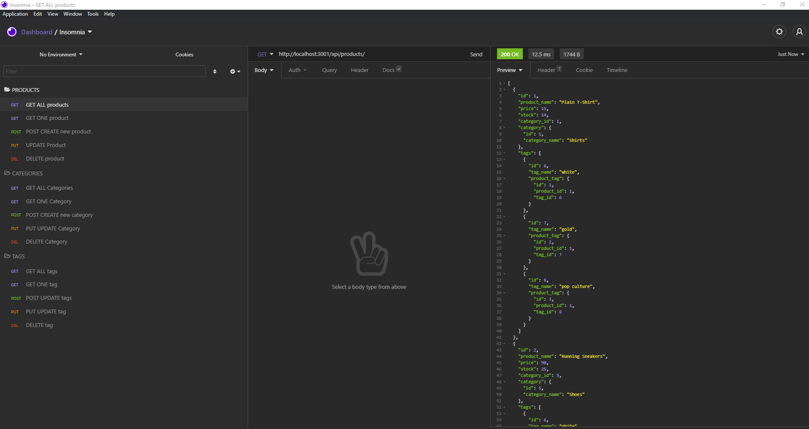

# E-commerce Back End
  

  ## Description
 This is a e-commerce back-end for a e-commerce website that utilizes a functional Express.js API.  

  * Link for ScreenCastify video presentation [ScreenCastify](https://drive.google.com/file/d/1fw57Kk3Ab8b0ung0dsrAfbNe5bf_SPdg/view?usp=sharing)  
  * Link for mp4 video presentation [Mp4](https://drive.google.com/file/d/12rGvHufc6_U9QWmerB1FYWUvQaD9pb5c/view?usp=sharing)    
  * Link for GitHub Repository [GitHub](https://github.com/a7063p/week-13-challenge.git)  

  ## Table of Contents
  * [Installation](#Installation)
  * [Usage](#Usage)
  * [License](#License)
  * [Languages](#Languages)  
  
  
  * [Questions](##Questions) 
  

  ## Installation
  This application requires access to command line interface and utilizes Node.js, Mysql2 package, Express package and Insominia. Users must create the database through mysql terminal and running the source db/schema.sql. once the database is constructed, the user should seed the data base through the CLI by running npm start.

  ## Usage
  This is the back-end of the e-commerce site only. The user needs to run all tests through Insomnia to observe functionality:  
  Three models were constructed for the PRODUCTS, CATEGORIES and TAGS. Each model has full CRUD functionality.
  

    
  
  ## Languages  
        
       
 

  ## License
  
  
  This application currently is licensed with MIT. 
 

  

  ## Contribute
  Contributor privileges are open to ALL that want to positively contribute to this project

  
  

  ## Questions
  Please feel free to email me with any comments, questions or concerns at ap@ampiUSA.com

  [GitHub Account](https://github.com/a7063p)
